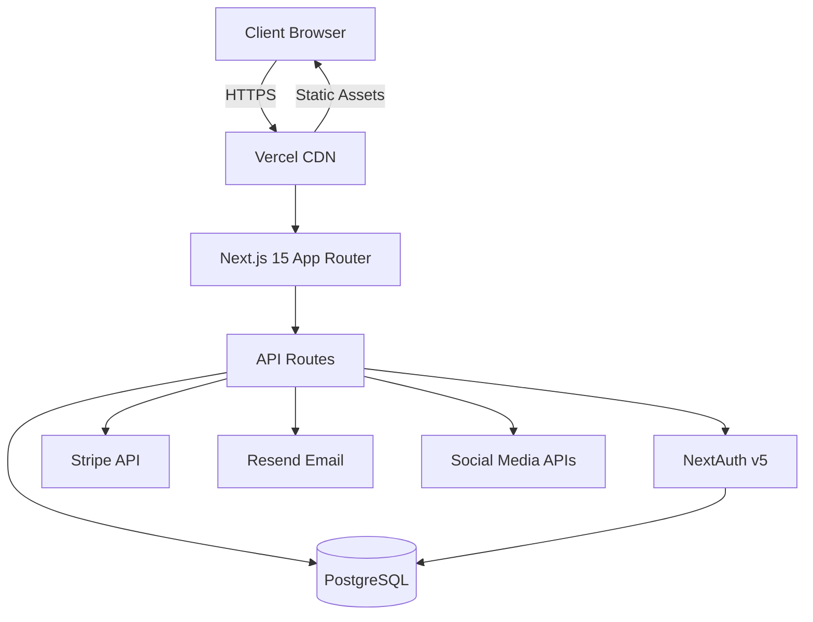
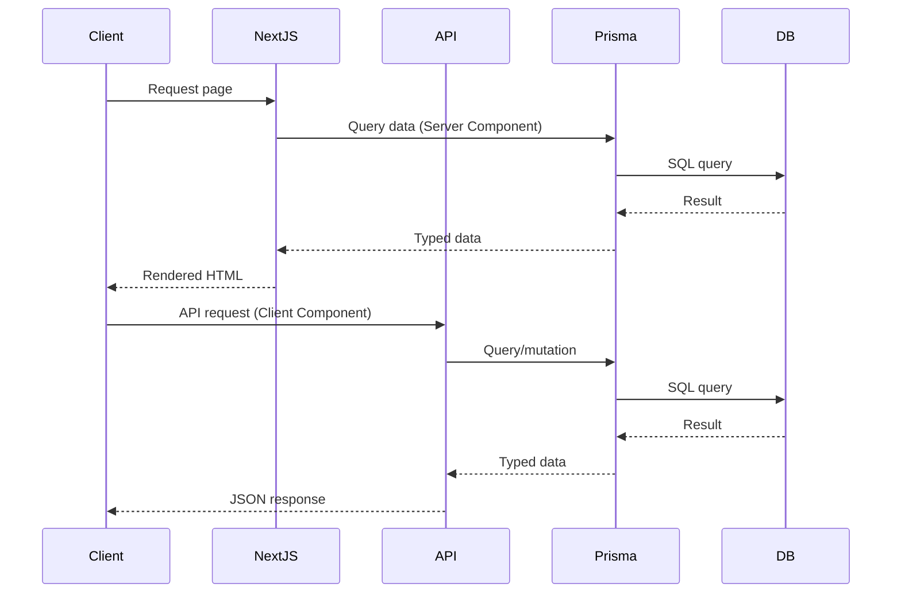
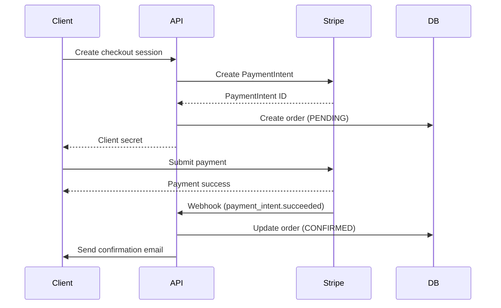
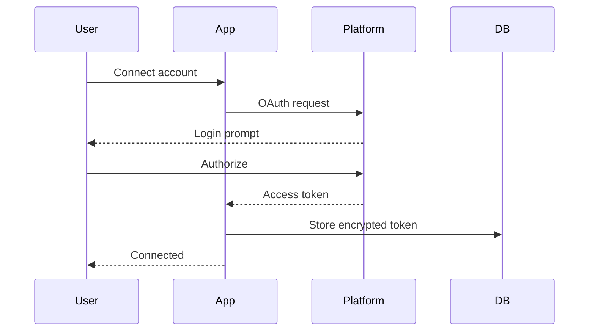
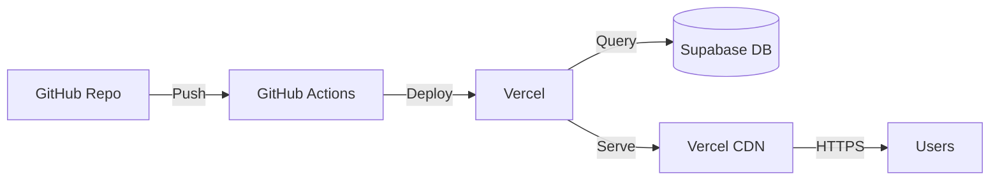

# System Architecture

Comprehensive overview of the E-Commerce Web Store architecture, design patterns, and technical decisions.

## Architecture Overview



## Technology Stack

### Frontend

- **Next.js 15**: React framework with App Router
- **React 19**: UI library with Server Components
- **TypeScript 5.6+**: Type-safe development
- **Tailwind CSS 3.4+**: Utility-first styling
- **Framer Motion 11.x**: Animation library
- **@react-three/fiber 8.x**: 3D graphics for button animations
- **Zustand 5.x**: Client-side state management
- **React Hook Form 7.x**: Form handling
- **Zod 3.x**: Schema validation

### Backend

- **Next.js API Routes**: Serverless API endpoints
- **Prisma 6.x**: Type-safe ORM
- **PostgreSQL 16.x**: Relational database
- **NextAuth v5**: Authentication
- **Stripe 21.x**: Payment processing
- **Resend**: Transactional emails

### Testing

- **Vitest 4.x**: Unit & integration tests
- **Playwright 1.48+**: E2E tests
- **Testing Library**: Component testing
- **MSW 2.x**: API mocking

### DevOps

- **GitHub Actions**: CI/CD pipeline
- **Vercel**: Hosting & deployment
- **Supabase**: PostgreSQL hosting
- **Husky**: Git hooks
- **ESLint**: Code linting
- **Prettier**: Code formatting

## Application Architecture

### App Router Structure

```
src/app/
├── (admin)/              # Admin dashboard (protected)
│   ├── dashboard/        # Admin overview
│   └── layout.tsx        # Admin layout with sidebar
├── (auth)/               # Authentication pages
│   ├── login/
│   ├── register/
│   └── verify-email/
├── (main)/               # Main app (public/protected)
│   ├── profile/          # User profile
│   └── layout.tsx        # Main layout with header/footer
├── [locale]/             # Localized routes
│   ├── page.tsx          # Homepage
│   ├── checkout/         # Checkout flow
│   ├── wishlist/         # Wishlist page
│   └── layout.tsx        # Locale-aware layout
└── api/                  # API routes
    ├── auth/             # Auth endpoints
    ├── products/         # Product CRUD
    ├── cart/             # Cart operations
    ├── checkout/         # Checkout & payment
    ├── orders/           # Order management
    ├── reviews/          # Review system
    ├── wishlist/         # Wishlist operations
    ├── social/           # Social media integration
    ├── webhooks/         # Stripe webhooks
    └── admin/            # Admin operations
```

### Component Architecture

```
src/components/
├── ui/                   # Primitive UI components
│   ├── button.tsx
│   ├── input.tsx
│   ├── card.tsx
│   └── ...
├── design-system/        # Design system components
│   ├── button-3d.tsx     # 3D animated button
│   └── page-transition.tsx
├── layout/               # Layout components
│   ├── header.tsx
│   ├── footer.tsx
│   └── sidebar.tsx
├── product/              # Product-related components
│   ├── product-card.tsx
│   ├── product-gallery.tsx
│   ├── product-filters.tsx
│   └── ...
├── cart/                 # Cart components
├── checkout/             # Checkout components
├── auth/                 # Auth components
├── admin/                # Admin components
└── providers/            # Context providers
```

## Data Architecture

### Database Schema

See `prisma/schema.prisma` for complete schema. Key models:

#### Core Models

- **User**: User accounts with role-based access
- **Product**: Product catalog with variants
- **Category**: Hierarchical product categories
- **Order**: Order records with status tracking
- **Cart**: Shopping cart (user or guest)

#### Supporting Models

- **Review**: Product reviews with ratings
- **Wishlist**: User wishlists
- **Address**: Shipping/billing addresses
- **Currency**: Multi-currency support
- **AnalyticsEvent**: User behavior tracking

#### Social Media Models

- **SocialPost**: Scheduled/published posts
- **SocialCampaign**: Marketing campaigns
- **SocialComment**: Unified comment management
- **SocialConnection**: OAuth connections
- **AutomationWorkflow**: Automation rules

### Data Flow



## Authentication & Authorization

### NextAuth v5 (Auth.js)

```typescript
// src/lib/auth/config.ts
export const authConfig = {
  providers: [Credentials, Google, Facebook],
  adapter: PrismaAdapter(prisma),
  session: { strategy: 'jwt' },
  callbacks: {
    jwt: async ({ token, user }) => {
      // Add user role to token
      if (user) {
        token.role = user.role
      }
      return token
    },
    session: async ({ session, token }) => {
      // Add role to session
      session.user.role = token.role
      return session
    },
  },
}
```

### Role-Based Access Control

```typescript
enum UserRole {
  USER, // Regular customer
  ADMIN, // Store admin
  SUPERADMIN, // Full system access
}
```

Middleware protects routes:

```typescript
// src/middleware.ts
export default auth((req) => {
  const isAdmin = req.auth?.user?.role === 'ADMIN'
  const isAdminRoute = req.nextUrl.pathname.startsWith('/dashboard')

  if (isAdminRoute && !isAdmin) {
    return Response.redirect(new URL('/', req.url))
  }
})
```

## Payment Processing

### Stripe Integration



### Idempotency

All payment operations use idempotency keys to prevent duplicate charges:

```typescript
const idempotencyKey = `order_${orderId}_${Date.now()}`

const paymentIntent = await stripe.paymentIntents.create(
  { amount, currency, metadata: { orderId } },
  { idempotencyKey },
)
```

## State Management

### Server State (React Query)

```typescript
// Product data fetching
const { data: products } = useQuery({
  queryKey: ['products', filters],
  queryFn: () => fetchProducts(filters),
})
```

### Client State (Zustand)

```typescript
// Cart state
const useCartStore = create<CartState>((set) => ({
  items: [],
  addItem: (item) =>
    set((state) => ({
      items: [...state.items, item],
    })),
  removeItem: (id) =>
    set((state) => ({
      items: state.items.filter((i) => i.id !== id),
    })),
}))
```

### Context Providers

```typescript
// Currency context
export function CurrencyProvider({ children }) {
  const [currency, setCurrency] = useState('USD');
  return (
    <CurrencyContext.Provider value={{ currency, setCurrency }}>
      {children}
    </CurrencyContext.Provider>
  );
}
```

## Internationalization (i18n)

### Next-Intl Integration

```typescript
// src/lib/i18n/config.ts
export const locales = ['en', 'es', 'fr', 'de', 'ja', 'zh']
export const defaultLocale = 'en'

// Route structure: /[locale]/products
// Example: /en/products, /es/productos
```

### Message Files

```
src/lib/i18n/messages/
├── en.json
├── es.json
├── fr.json
├── de.json
├── ja.json
└── zh.json
```

Usage:

```typescript
import { useTranslations } from 'next-intl';

function Component() {
  const t = useTranslations('Products');
  return <h1>{t('title')}</h1>;
}
```

## Multi-Currency Support

### Currency Conversion

```typescript
// Prices stored in cents (USD base)
const priceInCents = 9999 // $99.99

// Convert to user's currency
const convertedPrice = convertCurrency(priceInCents, 'USD', userCurrency, exchangeRates)
```

### Decimal Arithmetic

Uses `decimal.js` to avoid floating-point errors:

```typescript
import Decimal from 'decimal.js'

const price = new Decimal(99.99)
const tax = price.times(0.08) // 8% tax
const total = price.plus(tax)
```

## Performance Optimization

### Image Optimization

```typescript
import Image from 'next/image';

<Image
  src={product.image}
  alt={product.name}
  width={800}
  height={600}
  loading="lazy"
  placeholder="blur"
/>
```

### Code Splitting

```typescript
// Dynamic imports for heavy components
const AdminDashboard = dynamic(() => import('./admin-dashboard'), {
  loading: () => <Spinner />,
  ssr: false,
});
```

### Database Optimization

```typescript
// Efficient queries with Prisma
const products = await prisma.product.findMany({
  where: { isActive: true },
  include: {
    images: { take: 1 },
    category: { select: { name: true } },
  },
  take: 20,
  skip: page * 20,
})
```

### Caching Strategy

- **Static Pages**: Pre-rendered at build time
- **ISR**: Revalidate product pages every 60s
- **Dynamic**: User-specific pages (cart, profile)

```typescript
// ISR example
export const revalidate = 60 // Revalidate every 60 seconds
```

## Security

### Input Validation

```typescript
import { z } from 'zod'

const productSchema = z.object({
  name: z.string().min(1).max(200),
  price: z.number().int().positive(),
  sku: z.string().regex(/^[A-Z0-9-]+$/),
})
```

### SQL Injection Prevention

Prisma uses parameterized queries automatically:

```typescript
// Safe from SQL injection
const user = await prisma.user.findUnique({
  where: { email: userInput },
})
```

### XSS Prevention

React escapes content by default. For HTML content:

```typescript
import DOMPurify from 'isomorphic-dompurify'

const clean = DOMPurify.sanitize(userContent)
```

### CSRF Protection

NextAuth includes CSRF tokens automatically.

### Rate Limiting

```typescript
// API route rate limiting
import { rateLimit } from '@/lib/rate-limit'

export async function POST(req: Request) {
  const limiter = rateLimit({ interval: 60000, limit: 10 })
  await limiter.check(req)
  // ... handle request
}
```

## Monitoring & Analytics

### Custom Analytics

```typescript
// Track events
trackEvent({
  type: 'ADD_TO_CART',
  productId: product.id,
  userId: user?.id,
  metadata: { price, quantity },
})
```

### Error Tracking

```typescript
// Error boundary
export function ErrorBoundary({ error }) {
  useEffect(() => {
    // Log to error tracking service
    logError(error);
  }, [error]);

  return <ErrorPage />;
}
```

### Performance Monitoring

```typescript
// Web Vitals
import { onCLS, onFID, onLCP } from 'web-vitals'

onCLS(console.log)
onFID(console.log)
onLCP(console.log)
```

## Social Media Integration

### OAuth Flow



### Post Scheduling

```typescript
// Schedule post
await prisma.socialPost.create({
  data: {
    platform: 'INSTAGRAM',
    content: 'Check out our new product!',
    scheduledFor: new Date('2026-04-01T10:00:00Z'),
    status: 'SCHEDULED',
  },
})

// Cron job publishes scheduled posts
```

## Design System

### Dark Gradient Neomorphic Theme

```css
/* Neomorphic card */
.neo-card {
  background: linear-gradient(145deg, #1a1a2e, #16213e);
  box-shadow:
    20px 20px 60px #0f0f1a,
    -20px -20px 60px #252542;
  border-radius: 20px;
}
```

### 3D Animated Buttons

```typescript
// Using @react-three/fiber
<Button3D
  onClick={handleClick}
  depth={0.5}
  color="#6366f1"
>
  Add to Cart
</Button3D>
```

## Deployment Architecture



### CI/CD Pipeline

1. **Push to branch**: Triggers GitHub Actions
2. **Run tests**: Unit, integration, E2E
3. **Lint & type check**: ESLint + TypeScript
4. **Build**: Next.js production build
5. **Deploy preview**: Vercel preview deployment
6. **Merge to main**: Deploy to production

## Scalability Considerations

### Database

- **Connection pooling**: Prisma connection pool
- **Indexes**: Strategic indexes on frequently queried fields
- **Read replicas**: For high-traffic scenarios (future)

### Caching

- **CDN**: Static assets cached at edge
- **ISR**: Incremental Static Regeneration for product pages
- **Redis**: Session/cart caching (optional)

### API

- **Serverless functions**: Auto-scaling with Vercel
- **Rate limiting**: Prevent abuse
- **Pagination**: Limit query results

## Future Enhancements

- **GraphQL API**: For complex queries
- **Microservices**: Split admin/storefront
- **Message Queue**: For async tasks (email, social posts)
- **CDN optimization**: Multi-region deployment
- **AI recommendations**: ML-based product suggestions

## References

- [Next.js Documentation](https://nextjs.org/docs)
- [Prisma Documentation](https://www.prisma.io/docs)
- [Stripe Documentation](https://stripe.com/docs)
- [NextAuth Documentation](https://authjs.dev)
